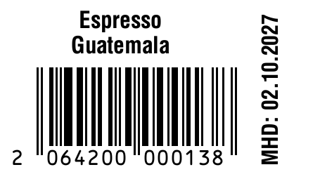

# Etikettendruck

Druckt einfache Produktetiketten mit **Titel, EAN-13-Barcode und MHD** auf einem
Citizen-Etikettendrucker (Referenz: CL-S521, 57 × 32 mm).

Das Programm erzeugt **ZPL**, die Druckersprache des Druckers, und schickt sie
unverändert an den Drucker. Es gibt kein PDF, keinen Treiber und kein Rastern.
Text und Barcode erzeugt der Drucker selbst. Vorschau und Druck verwenden denselben
ZPL-Text. Warum das so gelöst ist, steht in [`assets/insights.md`](assets/insights.md)
und [`docs/ENTSCHEIDUNGEN.md`](docs/ENTSCHEIDUNGEN.md).



- **Nur Python-Standardbibliothek.** Python ≥ 3.11 genügt, nichts muss per `pip`
  installiert werden.
- **Bedienung im Browser** in drei Schritten: Produkt wählen → Menge → Drucken.
- **MHD** wird aus Abpackdatum und Haltbarkeit des Produkts berechnet und lässt
  sich überschreiben.
- **Vorschau** über labelary.com ist optional. Fehlt das Internet, wird trotzdem
  gedruckt.
- **Druckprotokoll** in `var/druckprotokoll.csv`.

---

## Schnellstart (Linux Mint, Drucker per USB)

```sh
# 1. Einmalig: Schreibrecht auf den USB-Drucker, danach ab- und wieder anmelden
sudo usermod -aG lp $USER

# 2. Prüfen, ob alles passt
python3 -m etiketten check

# 3. Testetikett drucken: Rahmen, Umlaute, Barcode
python3 -m etiketten testdruck

# 4. Oberfläche starten (öffnet den Browser auf http://localhost:8077)
./start.sh
```

Optional legt `scripts/desktop-verknuepfung.sh` einen Eintrag „Etikettendruck“
im Startmenü an.

> **Stand 06.10.2026:** Am echten CL-S521 getestet, Druck über USB und
> Weboberfläche funktioniert. **Offene Punkte** (u. a. Barcode am Kassenscanner
> prüfen, Haltbarkeiten in der CSV eintragen) stehen in
> [`docs/ENTSCHEIDUNGEN.md`](docs/ENTSCHEIDUNGEN.md#offene-punkte).

## Bedienung

1. **Produkt** antippen.
2. **Abgepackt am** ist heute. Das **MHD** wird daraus berechnet
   (Haltbarkeit pro Produkt in der CSV). Ein MHD von Hand ändern ist möglich, dann
   steht dort „manuell“. „wieder berechnen“ schaltet zurück.
3. **Anzahl** wählen und **Drucken** drücken. Ab 50 Etiketten wird nachgefragt.

Unter **Werkzeuge** gibt es das Testetikett und den erzeugten ZPL-Text.
Ein Direktlink auf ein Produkt geht so: `http://localhost:8077/?produkt=kolumbien`.

## Produkte pflegen

Die Produkte stehen in [`data/produkte.csv`](data/produkte.csv):

```csv
id,name,gtin,mhd_monate
kolumbien,Kolumbien,2064000002134,12
espresso-guatemala,Espresso|Guatemala,2064200000138,12
```

| Spalte       | Bedeutung |
|--------------|-----------|
| `id`         | Kurzname ohne Leerzeichen, eindeutig (für Links und Kommandozeile) |
| `name`       | Text auf dem Etikett. `|` erzwingt einen Zeilenumbruch, sonst bricht das Programm selbst um (max. 2 Zeilen, die Schrift wird bei Bedarf kleiner) |
| `gtin`       | EAN-13 mit Prüfziffer. Die wird geprüft, Tippfehler fallen sofort auf |
| `mhd_monate` | Haltbarkeit ab Abpackdatum in Monaten |

Änderungen gelten sofort, ohne Neustart. `python3 -m etiketten check` prüft die
Datei. Die bisherigen sechs Produkte und EANs stammen aus `assets/Edeka Barcodes.svg`.
**Die 12 Monate Haltbarkeit sind ein Platzhalter. Bitte prüfen.**

## Konfiguration

Alles Einstellbare steht kommentiert in [`config.toml`](config.toml): Druckweg,
Etikettengröße, Kalibrierung, Layout in Millimetern, Zeichensatz und Vorschau.
Eine andere Datei lässt sich mit `--config pfad` oder `ETIKETTEN_CONFIG=pfad` verwenden.

**Kalibrieren:** Testetikett drucken. Der Rahmen sollte überall 2 mm Abstand
zum Rand haben. Falls nicht, `versatz_x` / `versatz_y` unter `[etikett]` in mm
anpassen (positiv = nach rechts/unten).

**Trockenlauf ohne Drucker:** `transport = "datei"` schreibt jede Sendung als
`.zpl`-Datei nach `var/ausgabe/`.

## Kommandozeile

```sh
python3 -m etiketten start [--port 8077] [--host 0.0.0.0] [--kein-browser]
python3 -m etiketten produkte
python3 -m etiketten check
python3 -m etiketten testdruck
python3 -m etiketten zpl kolumbien --mhd 02.10.2027 --menge 3   # nur ausgeben
python3 -m etiketten drucken kolumbien --menge 12              # MHD berechnet
```

## Projektstruktur

```
etiketten/
  zpl.py        Layout → ZPL (die einzige Stelle, an der das Etikett entsteht)
  drucker.py    Druckwege: usb, cups, tcp, datei
  dienst.py     verbindet Produkte, MHD, ZPL, Druckweg, Vorschau, Protokoll
  server.py     Weboberfläche + JSON-API
  cli.py        Kommandozeile
  produkte.py   CSV lesen, EAN prüfen
  mhd.py        Datumsrechnung
  config.py     config.toml laden
  static/       Oberfläche ohne Build-Schritt: Web Component <etiketten-app>
                (etiketten-app.js/.css), index.html bindet es ein
data/produkte.csv
config.toml
docs/           Architektur, Drucker-Einrichtung, Entscheidungen
fragen/         Fragenkataloge (Druckprogramm, Etikettenkonzept)
assets/         alte SVG-Vorlage und Erkenntnisse aus dem ersten Versuch
tests/
```

## Tests

```sh
python3 -m unittest discover -s tests -t .
```

## Weitere Dokumentation

- [`docs/DRUCKER.md`](docs/DRUCKER.md): Drucker einrichten, Emulation, CUPS, Fehlersuche
- [`docs/ARCHITEKTUR.md`](docs/ARCHITEKTUR.md): Aufbau, API, Erweiterung (Raspberry Pi, Enterprise-System)
- [`docs/ENTSCHEIDUNGEN.md`](docs/ENTSCHEIDUNGEN.md): getroffene Entscheidungen und offene Punkte
